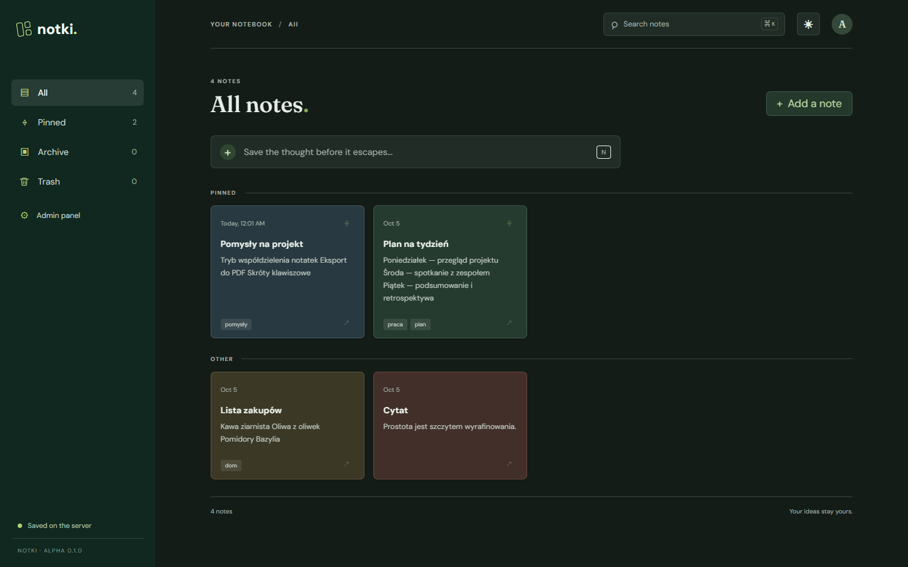
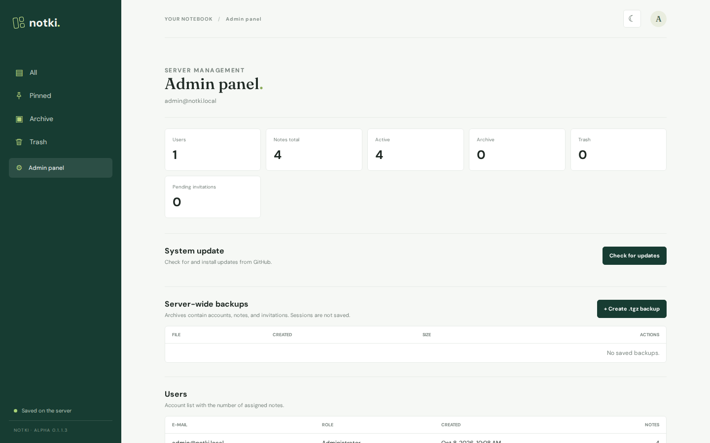
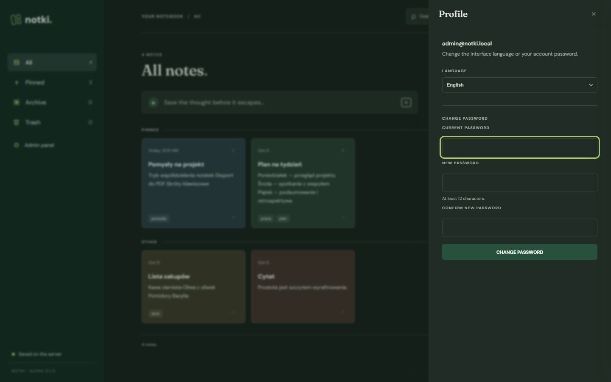

# Notki

Private notes app with per-user SQLite storage, invitation-only registration, and an administrator dashboard. **ALPHA 0.1.0**



## Features

- Notes with rich text, tags, colors, pinning, archive, and trash
- Per-user SQLite storage on your own server
- Invitation-only registration — each link works once and expires after 7 days
- Admin panel with server statistics, user list, and invitations
- Server-wide `.tgz` backups: create, download, restore, delete
- Polish and English interface, light and dark theme
- Profile panel for changing the language and password

## Run locally

Requires Python 3.9 or newer. The server uses only Python's standard library.

```powershell
python server.py
```

On a fresh database, open the local address printed by the server. Notki opens the first-run administrator form, which is available only from the local machine and can be used once. The password must be at least 12 characters long.

After setup, sign in and choose **Panel administracyjny** to create registration links. The SQLite database lives at `data/notki.sqlite3`.

The first administrator can also be created from a terminal:

```powershell
python server.py --create-admin
```

## Admin panel



From **Backupy całego serwera** you can create timestamped `.tgz` archives stored in `data/backups`. Each archive contains all accounts, password hashes, notes, and invitations; active sessions are excluded. Keep backups private because they contain password hashes. Restoring replaces the current server data and logs everyone out.

On a fresh server you can import a `.tgz` backup on the first-run setup page instead of creating an administrator.

## Profile



Clicking the avatar in the top-right corner opens a menu with **Profile** and **Sign out**. The profile panel lets you change the interface language and the account password. Changing the password requires the current password, must be at least 12 characters long, and signs out every other session while keeping the current one active.

## Languages and themes

The interface is available in Polish and English. The initial language follows the browser's `Accept-Language` header and falls back to English; the choice is stored in `localStorage` under `notki.lang.v1`. Server-side messages are translated from the same header, so API errors arrive in the selected language.

All pages share `theme.js`. The theme follows the operating system setting until the toggle is used; the explicit choice is stored in `localStorage` under `notki.theme.v1`.

## Run on Linux

```sh
sudo apt update
sudo apt install python3
git clone <repository-url> Notki
cd Notki
python3 server.py
```

The server listens on `127.0.0.1:8000` by default. For remote access, keep it bound to loopback and use an SSH tunnel:

```sh
ssh -L 8000:127.0.0.1:8000 <user>@<server-address>
```

For a permanent service, run Notki behind a TLS-enabled reverse proxy. Example systemd unit for code in `/opt/notki` and a `notki` system account:

```ini
[Unit]
Description=Notki private notes app
After=network.target

[Service]
Type=simple
User=notki
Group=notki
WorkingDirectory=/opt/notki
Environment=NOTKI_HOST=127.0.0.1
Environment=NOTKI_PORT=8000
Environment=NOTKI_COOKIE_SECURE=1
Environment=NOTKI_PUBLIC_HTTPS=1
ExecStart=/usr/bin/python3 /opt/notki/server.py
Restart=on-failure
RestartSec=3
UMask=0077
NoNewPrivileges=true
ProtectSystem=strict
ProtectHome=true
PrivateTmp=true
ReadWritePaths=/opt/notki/data

[Install]
WantedBy=multi-user.target
```

```sh
sudo systemctl daemon-reload
sudo systemctl enable --now notki
```

## Configuration

- `NOTKI_HOST`: bind address; defaults to `127.0.0.1`.
- `NOTKI_PORT`: HTTP port; defaults to `8000`.
- `NOTKI_DB_PATH`: optional SQLite database path.
- `NOTKI_BACKUP_DIR`: optional directory for backup archives; defaults to `backups` beside the database.
- `NOTKI_COOKIE_SECURE=1`: mark session cookies Secure when served through HTTPS.
- `NOTKI_PUBLIC_HTTPS=1`: generate HTTPS invitation URLs when TLS terminates in a reverse proxy.

The built-in HTTP server is intended for local use. For remote access, put it behind a TLS-enabled reverse proxy and set the secure-cookie options above.

## Tests

```powershell
python -m unittest discover -s tests
```
