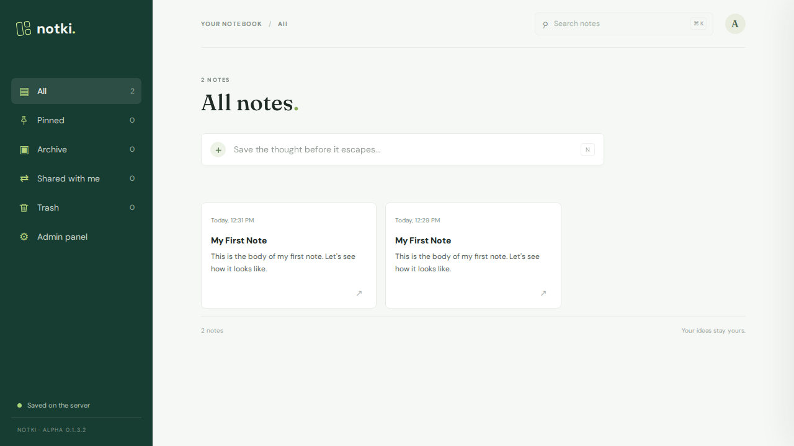
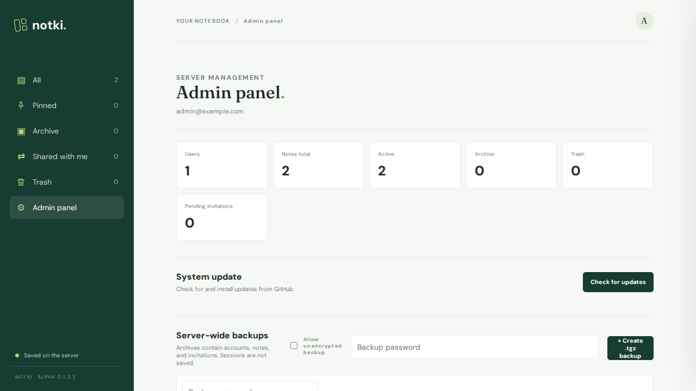
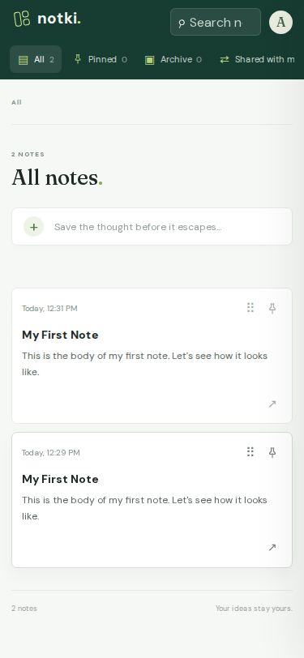
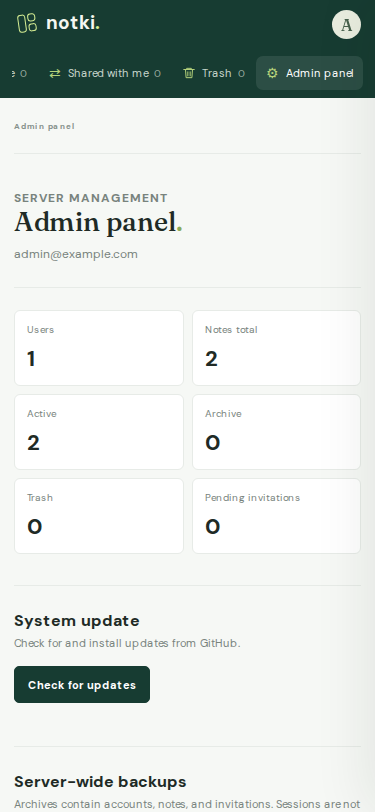

# Notki

Private notes app with per-user SQLite storage, invitation-only registration, and an administrator dashboard.

## Desktop




## Mobile




## Features

- Notes with rich text, tags, colors, pinning, archive, and trash
- Per-user SQLite storage on your own server
- Docker Compose setup that runs the stock Alpine image with a persistent data volume
- Invitation-only registration — each link works once and expires after 7 days
- Admin panel with server statistics, user list, and invitations
- Server-wide `.tgz` backups: create, download, restore, delete
- Polish and English interface, light and dark theme
- Profile panel for changing the language, avatar, and password
- Note sharing between accounts with read-only or edit permission

## Run with Docker (Recommended)

The easiest and recommended way to run Notki is using Docker Compose. The compose file uses the stock `alpine` image directly — nothing is built. On start, the container installs `python3` with `apk` and runs the server, so the image itself is never modified.

```sh
docker compose up -d
```

Notki will be available at <http://127.0.0.1:8000>. Because the database starts empty, the first visit redirects to `/setup` to create the administrator account.

The application code is bind-mounted from the current directory, and the database and backup archives live in the `notki-data` named volume:

```
/app/data/notki.sqlite3
/app/data/backups/*.tgz
```

The volume survives `docker compose down` and restarts. To wipe everything and start over, remove it explicitly:

```sh
docker compose down -v
```

### Environment Variables for Docker Compose

You can configure Notki by setting these environment variables before starting the container:

- `NOTKI_HTTP_PORT`: Host port to publish to (default: `8000`). Example: `NOTKI_HTTP_PORT=9000 docker compose up -d`.
- `NOTKI_COOKIE_SECURE`: Set to `1` to mark session cookies as Secure when served through HTTPS. (default: `0`).
- `NOTKI_PUBLIC_HTTPS`: Set to `1` to generate HTTPS invitation URLs when TLS terminates in a reverse proxy. (default: `0`).
- `NOTKI_ALLOW_REMOTE_SETUP`: Set to `1` to permit the initial admin setup from a remote host. By default it's `1` in docker-compose.
- `NOTKI_HOST`: internal bind address (default: `0.0.0.0` in Docker).
- `NOTKI_PORT`: internal HTTP port (default: `8000` in Docker).
- `NOTKI_DB_PATH`: SQLite database path inside container.
- `NOTKI_BACKUP_DIR`: directory for backup archives inside container.

## Install on Linux

You can quickly install and run Notki directly on Linux using the provided installation script. It clones the repository and sets up a systemd service.

```sh
curl -sSL https://raw.githubusercontent.com/shirou93/Notki/main/install.sh | sudo bash
```

The script will:
1. Install Python 3 if not present.
2. Clone the Notki repository to `/opt/notki`.
3. Create a dedicated `notki` system user.
4. Set up a systemd service (`notki.service`) listening locally on port 8000.
5. Enable and start the service automatically.

## Run locally

Requires Python 3.9 or newer. The server uses only Python's standard library.

```powershell
python server.py
```

On a fresh database, open the local address printed by the server. Notki opens the first-run administrator form, which is available only from the local machine and can be used once. The password must be at least 12 characters long.

After setup, sign in and choose **Panel administracyjny** / **Admin panel** to create registration links. The SQLite database lives at `data/notki.sqlite3`.

The first administrator can also be created from a terminal:

```powershell
python server.py --create-admin
```

## Admin panel

From **Backupy całego serwera** / **Server backups** you can create timestamped `.tgz` archives stored in `data/backups`. Each archive contains all accounts, password hashes, notes, and invitations; active sessions are excluded. Keep backups private because they contain password hashes. Restoring replaces the current server data and logs everyone out.

On a fresh server you can import a `.tgz` backup on the first-run setup page instead of creating an administrator.

## Profile

Clicking the avatar in the top-right corner opens a menu with **Profile**, **Admin panel** (administrators only), and **Sign out**. The profile panel lets you upload a custom avatar, change the interface language, and change the account password. Avatars accept PNG, JPEG, WebP, or GIF images up to 2 MB and are stored with your account, so they are included in server backups. Changing the password requires the current password, must be at least 12 characters long, and signs out every other session while keeping the current one active.

## Sharing notes

The share button on a note card (or in the editor) opens a panel where you enter the e-mail address of another account on the same server and pick a permission:

- **Read only** — the recipient can open the note and read it, but the editor is locked: the title, body, tags, and color are not editable, and the formatting toolbar is hidden.
- **Can edit** — the recipient can change the note's title, body, tags, and color. The change is written to the owner's note, so the owner sees it immediately.

Recipients find shared notes under **Shared with me** in the sidebar, each card labelled with the owner and the granted permission. Only the owner can pin, archive, delete, reorder, or re-share a note; recipients never get those controls. Sharing is limited to accounts that already exist on the server, and the recipient picker only suggests addresses — you can always type one manually. Revoking access removes the note from the recipient's list immediately. Shares are included in server backups.

## Languages and themes

The interface is available in Polish and English. Each dictionary lives in its own file in the `translations/` folder (`translations/en.js`, `translations/pl.js`), which registers itself on `window.notkiTranslations`; `i18n.js` holds only the lookup, pluralisation, date/number formatting, and DOM-translation logic. New strings belong in those dictionaries, not in `i18n.js`.

The initial language follows the browser's `Accept-Language` header and falls back to English; the choice is stored in `localStorage` under `notki.lang.v1`. Server-side messages are translated from the same header, so API errors arrive in the selected language.

All pages share `theme.js`. The theme follows the operating system setting until the toggle is used; the explicit choice is stored in `localStorage` under `notki.theme.v1`.

## Tests

```powershell
python -m unittest discover -s tests
```
